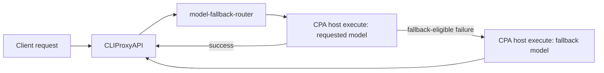

# CPA Model Fallback Router

[](https://github.com/thebtf/cpa-model-fallback-router/actions/workflows/test.yml)
[](https://github.com/thebtf/cpa-model-fallback-router/actions/workflows/release.yml)
[](https://github.com/thebtf/cpa-model-fallback-router/releases/latest)
[](LICENSE)

CPA Model Fallback Router is a native CLIProxyAPI plugin that retries matching model requests with configured fallback model names. It is built for the common quota-exhaustion case where a client requests a Claude model, the primary upstream fails, and CPA should transparently retry with another model such as `gpt-5.4`.

The plugin is intentionally model-name based. It asks CPA to execute the original requested model first, then retries configured fallback models when the first attempt fails with a fallback-eligible HTTP status, transport error, quota error, or rate-limit error.

## Quick Start

1. Download the zip for the CPA host platform from the [latest GitHub release](https://github.com/thebtf/cpa-model-fallback-router/releases/latest).
2. Verify it against the release `checksums.txt`.
3. Extract the archive; it contains the correctly named plugin library at the zip root.
4. Put the extracted library in CPA's configured plugin directory.
5. Enable the plugin under `plugins.configs.model-fallback-router`.

For the official Linux Docker image, the final mounted file commonly looks like this inside the container:

```text
/app/plugins/model-fallback-router.so
```

## Features

- Model-name fallback rules with `*` wildcard matching.
- Ordered fallback chains, for example Claude requests to `gpt-5.4`.
- Global or rule-level fallback status policies.
- Streaming-safe retry behavior that stops falling back after the first payload chunk is emitted.
- CPA store compatible release zips plus `checksums.txt`.
- Redoc-rendered configuration reference in `docs/index.html`.

## Compatibility

- Built for the CPA native plugin ABI from `github.com/router-for-me/CLIProxyAPI/v7`.
- Tested during extraction against the CPA v7.2.x plugin API.
- Current CPA plugin host callbacks do not expose the selected auth record or auth kind to plugin executors. Because of that, this plugin can scope by requested model and inbound source format, but cannot yet scope a rule to `anthropic oauth` versus an Anthropic API key.

## Configuration

```yaml
plugins:
  enabled: true
  dir: "/app/plugins"
  configs:
    model-fallback-router:
      enabled: true
      priority: 100

      rules:
        - name: claude_quota_to_gpt54
          source_formats:
            - claude
            - anthropic
          models:
            - claude-*
          primary_model: "$requested"
          fallback_models:
            - gpt-5.4

      fallback:
        enabled: true
        fallback_on_status:
          - 401
          - 403
          - 408
          - 409
          - 429
          - 500
          - 502
          - 503
          - 504
        no_fallback_on_status:
          - 400
          - 404
          - 422
```

## Configuration Rules

- `rules[].models` matches the client-requested model with `*` wildcards.
- `rules[].source_formats` optionally limits the inbound protocol. `anthropic` is normalized to `claude`.
- Omit `source_formats` to make a rule protocol-global.
- `primary_model` defaults to `$requested`, which means the original requested model.
- `fallback_models` are tried in order after a fallback-eligible failure.
- Rule-level `fallback_on_status` and `no_fallback_on_status` override the global fallback status lists for that rule.
- Non-streaming requests can fall back after a failed response.
- Streaming requests fall back only if the failure happens before the first payload chunk is emitted.
- If CPA loses the numeric HTTP status but the error text clearly indicates rate limiting or quota exhaustion, the plugin treats the failure as fallback eligible.

## Commands

Run tests:

```bash
go test ./...
```

Build a local Windows plugin zip:

```powershell
.\scripts\package-release.ps1 -Version 0.1.1 -GOOS windows -GOARCH amd64
```

Build a raw shared library for the current platform:

```bash
go build -buildmode=c-shared -o dist/model-fallback-router.so .
```

Cross-compiling a cgo shared library requires a C compiler for the target platform. The GitHub release workflow installs the extra compilers it needs for supported release targets.

## Architecture Overview

CPA loads this plugin as a native c-shared dynamic library. The plugin registers two capabilities:

- `model_router`, which decides whether a request should be routed to the plugin executor.
- `executor`, which calls CPA's host model executor for the primary model and then for fallback model names when policy allows retry.

The execution flow is:



The plugin does not call upstream providers directly. It delegates all model execution back to CPA so existing CPA providers, credentials, protocol translators, logging, and accounting remain in control.

## Troubleshooting

- CPA does not list the plugin: confirm `plugins.enabled` is `true`, `plugins.dir` points at the mounted directory, and the library filename is exactly `model-fallback-router.so`, `model-fallback-router.dylib`, or `model-fallback-router.dll` for the host platform.
- Requests do not fall back: confirm the requested model matches `rules[].models`, the inbound format matches `rules[].source_formats`, and the failure status is not listed in `no_fallback_on_status`.
- Streaming requests stop after an upstream error: fallback is only possible before the first stream chunk is sent to the client.
- Provider-specific OAuth scoping is missing: CPA does not currently expose selected auth/provider metadata to plugin executors, so this plugin cannot distinguish Anthropic OAuth from other Anthropic credentials yet.

## Releases

Push an annotated semver tag to build and publish release assets:

```bash
git tag -a v0.1.1 -m "Release v0.1.1"
git push origin main v0.1.1
```

The release workflow builds CPA plugin store compatible assets:

- `model-fallback-router_0.1.1_linux_amd64.zip`
- `model-fallback-router_0.1.1_linux_arm64.zip`
- `model-fallback-router_0.1.1_darwin_amd64.zip`
- `model-fallback-router_0.1.1_darwin_arm64.zip`
- `model-fallback-router_0.1.1_windows_amd64.zip`
- `checksums.txt`

Each zip contains exactly one root-level dynamic library named for the target platform: `model-fallback-router.so`, `model-fallback-router.dylib`, or `model-fallback-router.dll`.

## Documentation

Open `docs/index.html` to view the Redoc-rendered configuration reference. The source spec is `docs/openapi.yaml`.

See also:

- [Changelog](CHANGELOG.md)
- [Contributing guide](CONTRIBUTING.md)
- [CPA Plugins Store entry PR](https://github.com/router-for-me/CLIProxyAPI-Plugins-Store/pull/10)

## License

MIT License. See [LICENSE](LICENSE).
